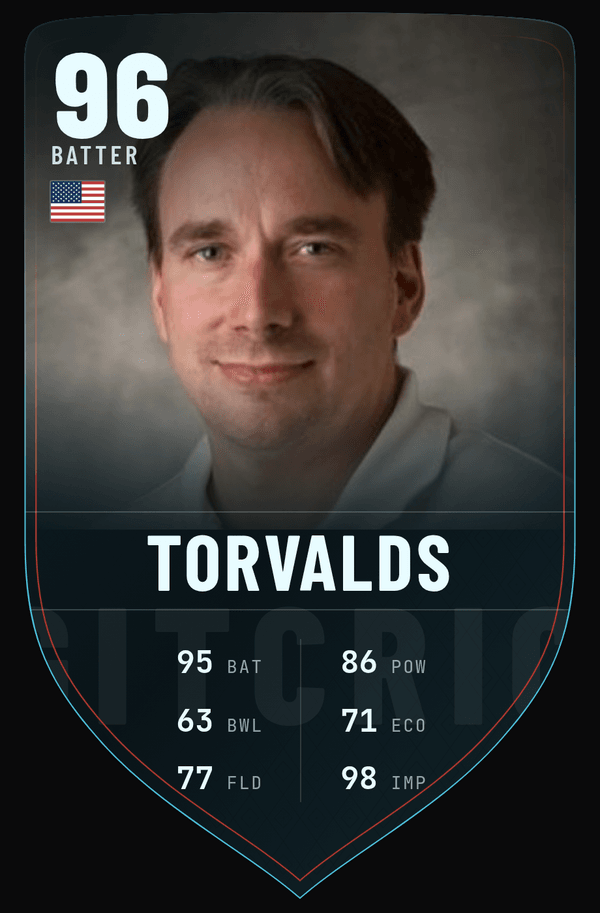
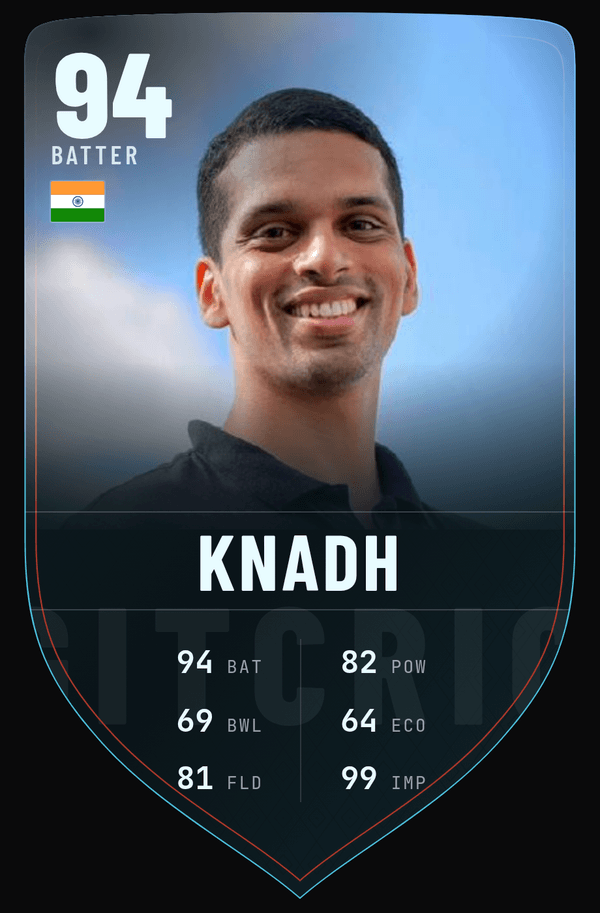
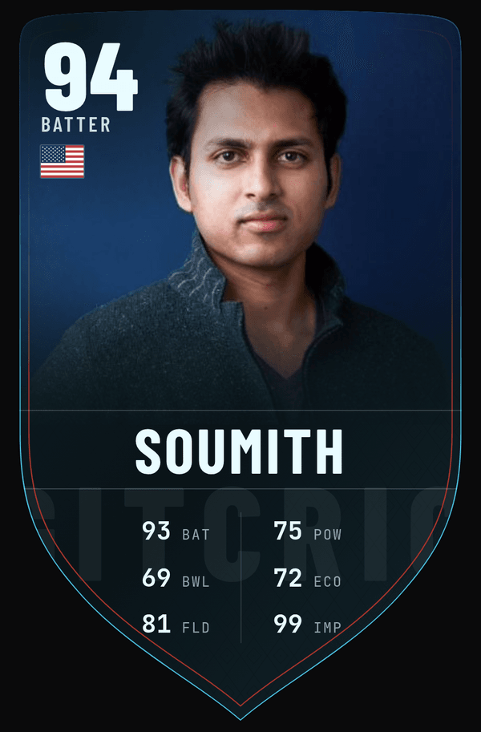

# GitCric 🏏

Your GitHub, rated out of 99 — as a cricket card.

<p align="center">
  
  
  
  <br />
  
  
</p>

## Scout your own

```
gitcric.vercel.app/<your-username>
```

That's the whole product. You get a card, a scout report of the signals behind it,
and the cricketer you'd be — toggle **Test · ODI · T20I · IPL** to meet a different
twin in each format. Kohli in T20Is doesn't mean Kohli in Tests.

## How the scouting works

Six signals off a live GitHub profile. No surveys, no self-reporting, nothing you
can fill in about yourself.

| Stat | Cricket meaning | What it reads |
|------|-----------------|---------------|
| **BAT** | Batting | total stars earned, weighted by your biggest repo |
| **POW** | Power | contributions in the last year — raw velocity |
| **BWL** | Bowling | pull requests opened on other people's repos, issues closed |
| **ECO** | Economy | focus: how concentrated your stars are, how tight your language stack is, how many PRs you actually land vs open |
| **FLD** | Fielding | code reviews, plus followers |
| **IMP** | Impact | lifetime contributions and how many years you've been active |

ECO is the one people argue with. It rewards finishing things — a maintainer with
one flagship and a high merge ratio reads high; forty half-abandoned repos across
eleven languages reads low. That's deliberate, and it's the closest honest analog
to a bowler who doesn't leak runs.

## The number

Two bands, borrowed from how the cricketers are scored. Your six stats are
role-weighted into a peak score that caps out — no matter how good the stats are,
that alone won't carry you past the low 80s. Everything above is a **greatness
band**, bought with sustained reach and years on the clock rather than a good
twelve months, which is why 99 is effectively unreachable and even 96 is rare.

The point of the cap is the twins. User OVRs are calibrated onto the *same* 40–99
scale as the real cricketers in the database, so "you're a 94" and "Muralitharan is
a 92" are the same sentence. Without that, matching you to a cricketer would be
decoration. With it, it's a lookup.

The cricketer side is stricter still: peak caps at 88, the greatness band runs
88→99, and 99 is pinned editorially — Kohli's ODI card is #1, Tendulkar's ODI #2.

## Tiers

The rim and finish on the card change with the number.

`bronze` under 70 · `silver` 70–83 · `gold` 84–90 · `immortal` 91+

The header line above the card names it differently — **ON THE FRINGE**, **IN THE
SQUAD**, **CAPTAIN'S PICK**, **GENERATIONAL** — because a tier is a material and a
selection is a verdict, and they're not the same thing.

## Under the hood

1,684 cricketers, 2,698 format cards, built from [Cricsheet](https://cricsheet.org)
ball-by-ball data through a SQLite pipeline that lands as static JSON in the web app.
Nothing queries a database at request time. Qualification gates keep the pool honest
— 8 Tests, 17 ODIs, 25 T20Is, 20 IPL matches, below which you don't get a card at all,
which is what stops a two-cap wonder turning up as your twin.

Twins are drawn from cricketers gated in at least two formats, sampled within ±3 OVR
of you (±4 up at the top, where the pool thins), seeded on your username so your card
never reshuffles.

335 player photos come from Wikimedia Commons under free licences, credited in
[`web/public/players/CREDITS.md`](web/public/players/CREDITS.md). Where Commons has
nothing usable, the card falls back to a monogram rather than ship something wrong.

**Built with** Next.js 15 · TypeScript · Tailwind v4 · Barlow Condensed & JetBrains Mono,
plus the SQLite → static-JSON data pipeline in [`src/`](src/).

## Credit

GitCric is a port of [**GitFut**](https://github.com/Younesfdj/gitfut) by
[@Younesfdj](https://github.com/Younesfdj) — the same idea, rated as football.
The two-band scoring engine here started as his, re-axed from PAC/SHO/PAS to
BAT/POW/BWL and recalibrated against a cricket population. GitFut is MIT-licensed;
the notice travels with the code in [NOTICE](NOTICE).

If you like this, go star his repo — the good idea was his first.

---

Pipeline docs: [`docs/pipeline.md`](docs/pipeline.md) · Cricket data © Cricsheet,
[CC BY 3.0](https://creativecommons.org/licenses/by/3.0/) · MIT
